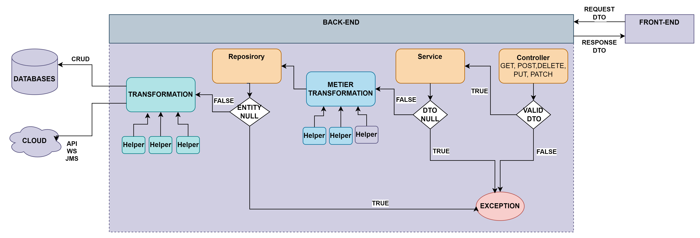

# Spring io
https://start.spring.io/
# asa-user-crud-demo
    Spring boot user crud démo
    Github repository: https://github.com/asa-7670/asa-user-crud-demo
### Backend architecture

### Feature 1: Say hello
    Develop an api that displays hello <username>
#### Dependencies:
    spring-boot-starter-web
#### Concept to see 
    - @RestController
    - @RequestMapping
    - @GetMapping
    - @ResponseEntity
    http://localhost:8080/api/v1/users/hello/<your-user-name>
### Feature 2 : User Crud
     Develop an api for user crud 
#### Step 1: add methods:   
    - add user  -> POST: <host>:<port>/api/v1/users
    - get users -> GET : <host>:<port>/api/v1/users
#### Dependencies
    - Lombok
    - spring-boot-starter-validation
#### Concept to see
    - Lombok function
    - dto
    - @PostMapping
    - @RequestBody  
    - @Valid
    - @Validated
    - @Service
    - @Repository
    - @Getter
    - @Setter
    - @NoArgsConstructor
    - @AllArgsConstructor
    - @ToString
    - @NotNull
    - @NotEmpty
    - @NotBlank
    - @Email
    - @Min
    - @Max
    - @JsonFormat
    - Custom error message 
### Feature 3: Entity: User Crud with repository
#### Step 2: add methods:
    - get user by id    -> GET    : <host>:<port>/api/v1/users/user/<user id>
    - update user       -> PATCH  : <host>:<port>/api/v1/users/user/<user id>
    - delete user by id -> DELETE : <host>:<port>/api/v1/users/user/<user id>
#### Dependencies
    - spring-boot-starter-data-jpa   
    - com.h2database:h2
#### Concept to see
    - @PathVariable
    - @NotNull
    - @Entity
    - @Table
    - @Id
    - @Column
    - @Transient
    - @JsonProperty
    - H2
    H2 access : http://localhost:8080/h2-console
### Feature 4: find user by email
#### Step 3: add method
    - findUserByEmail -> GET: <host>:<port>/api/v1/users/user?email=<user email>
#### Dependencies
    - spring-boot-starter-data-jpa
#### Concept to see
    - @RequestParam
    - @NotBlank